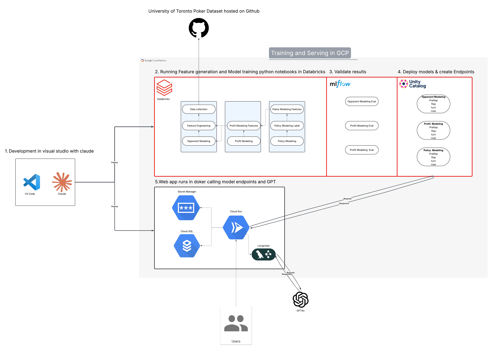

# PokerML

Machine Learning for Poker - A complete end-to-end ML pipeline for poker game analysis and intelligent play.

## Architecture



The system consists of:
1. **Development** - VS Code with Claude for application development
2. **Training & Serving (GCP/Databricks)** - Feature generation, model training, validation with MLflow, and deployment to Unity Catalog endpoints
3. **ML Models** - Opponent Modeling, Profit Modeling, and Policy Modeling (each with Preflop, Flop, Turn, River variants)
4. **Web Application** - Docker container on Cloud Run with Cloud SQL, Secret Manager, and LangChain integration calling GPT-4o

## Repository Structure

```
PokerML/
├── README.md                  # This file
├── PokerML-Databricks/        # ML model training (Databricks notebooks)
│   └── notebooks/
└── PokerML-App/               # Full-stack poker application
    ├── engine/                # Poker game engine
    ├── backend/               # FastAPI REST API
    ├── frontend/              # React/Vite client
    └── agents/                # Bot implementations
```

## Components

### [PokerML-Databricks](./PokerML-Databricks/)
Databricks notebooks for training ML models:
- Hand strength prediction
- Opponent modeling
- Action recommendation models

### [PokerML-App](./PokerML-App/)
Full-stack poker application featuring:
- **Poker Engine** - Config-driven game engine supporting Texas Hold'em, Leduc, and Kuhn poker
- **Backend API** - FastAPI server with ML model integration
- **Frontend Client** - Interactive poker table UI with ML predictions panel
- **Bot Opponents** - Heuristic and LLM-powered bots

## Quick Start

### Running the App
```bash
# Backend
cd PokerML-App/backend
pip install -r app/requirements.txt
uvicorn app.main:app --reload --port 8000

# Frontend
cd PokerML-App/frontend/poker-client
npm install
npm run dev
```

### Training Models
See the [PokerML-Databricks README](./PokerML-Databricks/README.md) for instructions on running the training notebooks.

## Technology Stack

| Component | Technologies |
|-----------|-------------|
| ML Training | Databricks, PySpark, MLflow |
| Backend | Python, FastAPI, SQLAlchemy |
| Frontend | TypeScript, React, Vite |
| Deployment | Docker, Google Cloud Build |

## License

CIS 508 Machine Learning in Business - Course Project
